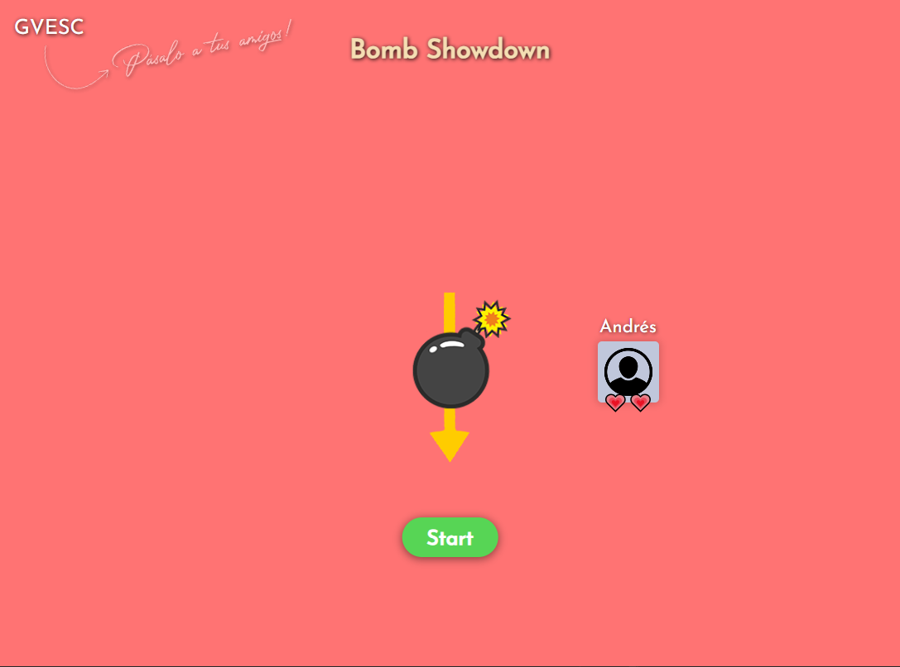
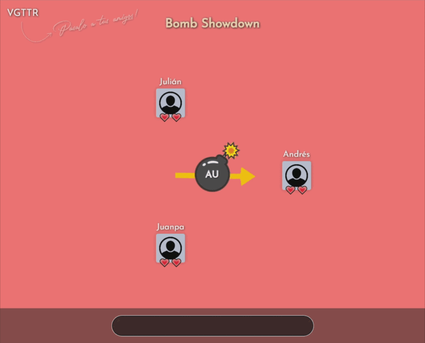
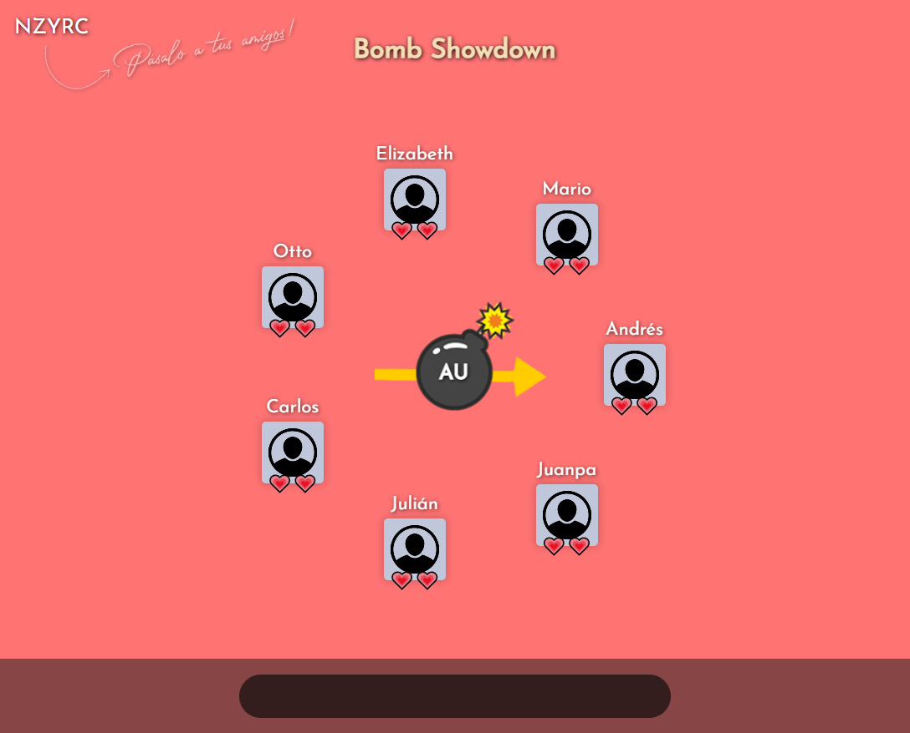

[](https://sonarcloud.io/summary/new_code?id=ARSW-2023_Bomb-Showdown)

# Bomb Showdown 💣⏱

**Bomb Showdown** es un juego multijugador en tiempo real basado en el juego de mesa hecho por Goliath **Tic Tac Boum**. Cada ronda, un jugador tiene la responsabilidad de desactivar la bomba adivinando una palabra relacionada con la pista dada. Si la bomba explota y el jugador no ha adivinado una palabra, el jugador perderá una vida. El último jugador que quede con vida, ganara la partida. ¡Demuestra tu agilidad mental y tus habilidades lingüísticas en este desafiante juego!

# Empezando 🚀

Estas instrucciones te proporcionarán una copia del proyecto en funcionamiento en tu máquina local para fines de
desarrollo y prueba.

## Requisitos previos

Para correr el proyecto necesitarás tener instalado el siguiente software
- [JDK](https://docs.aws.amazon.com/es_es/corretto/latest/corretto-8-ug/amazon-linux-install.html) version 1.8.x
- [Maven](https://maven.apache.org/download.cgi)
- [Git](https://git-scm.com/downloads)

## Instalación

Para obtener una copia de la aplicación deberás clonar este repositorio. Ingresa la siguiente instrucción en Git Bash:

```
git clone https://github.com/Bomb-Showdown/Bomb-Showdown.git
```

El proyecto main está preparado para funcionar con una arquitectura de software prediseñada, así que para correrlo localmente  deberás usar la versión de la rama **local-game**. Para esto, ejecuta el siguiente comando:

```
git checkout local-game
```

Luego, ejecuta el siguiente comando para compilar y empaquetar todo el proyecto (es importante que el SDK del proyecto
esté configurado con el 1.8):

```
mvn package
```

A partir de aquí tendrás una copia funcional del videojuego con la que podrás jugar de manera local con tus amigos. Solo tienes que ejecutar la clase **BombShowdownApplication** y entrar a la URL [http://localhost:8080](http://localhost:8080) por medio de un navegador web.

# Juego 🕹

Al entrar al videojuego por medio de [http://localhost:8080](http://localhost:8080), te encontrarás con el menú principal.


Aquí podrás escoger entre crear una lobby nueva o unirte a una ya creada. Al elegir unirse, deberás introducir el código  de la lobby que se autogenera al crearla.



Y listo! Tus amigos podrán entrar con el código que aparece en la esquina superior izquierda. Una vez todos estén dentro, el creador podrá iniciar la partida.



El juego finalizará cuando solo quede un jugador con vida.


El juego también cuenta con una ronda bonus en la que todos los jugadores podrán participar. El jugador que ingrese una palabra correcta antes que todos ganará una vida extra.


Y también puedes jugar con todas las personas que quieras!



## Built With 👷🏻‍♂️

* [Spring Boot](http://www.dropwizard.io/1.0.2/docs/) - The web framework used
* [Maven](https://maven.apache.org/) - Dependency Management
* [JavaScript](https://developer.mozilla.org/es/docs/Web/JavaScript) - Front-end code
* [SockJS](https://github.com/sockjs/sockjs-client) - WebSocket emulation
* [AnimateCSS](https://animate.style/) - Certain animations

## Authors 🖋

* **Andrés Ariza** - *Development & UI Design and Implementation* - [Andresariz88](https://github.com/Andresariz88)
* **Juan Pablo Sánchez** - *Development* - [JuanPablo70](https://github.com/JuanPablo70)
* **Julián Largo** - *Development* - [cisfjulian](https://github.com/cisfjulian)

See also the list of [contributors](https://github.com/Bomb-Showdown/Bomb-Showdown/graphs/contributors) who participated in this project.

## License 📄

This project is licensed under the Apache-2.0 License - see the [LICENSE](LICENSE) file for details